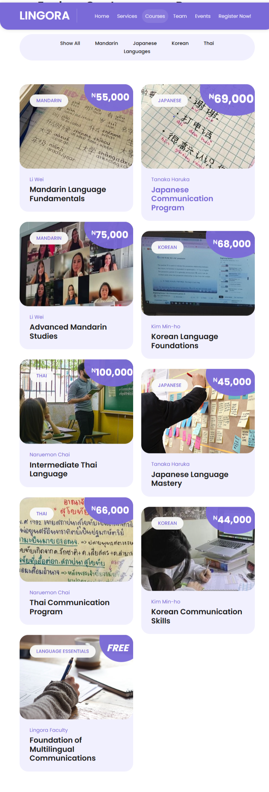
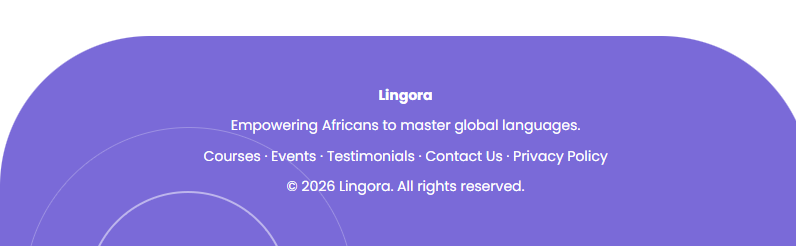

# Lingora-Language-Institute

**Lingora Language Institute** is a responsive and professional language learning website focused on helping African students master **Korean, Japanese, Mandarin, and Thai**. It is built using **HTML, CSS, and Bootstrap**, designed with a clean interface and engaging user experience.

---

## 🌐 Live Demo

Check out the live site on GitHub Pages:

[https://madu-olivia.github.io/Lingora-Language-Institute/]

---

## 📸 Screenshots

  
*Homepage with featured courses and carousel*

  
*Browse language courses and instructors*

  
*Custom footer with navigation and branding*

---

## ✨ Features

- **Responsive Design**: Desktop, tablet, and mobile friendly  
- **Courses**: Explore multiple languages, pricing, and instructor details  
- **Events**: Schedule and upcoming courses  
- **Testimonials**: Carousel showcasing student feedback  
- **Contact Section**: Placeholder form for user inquiries  
- **Custom Footer**: Vertical footer with branding and navigation  

---

## 🛠 Technologies Used

- **HTML5**  
- **CSS3**  
- **Bootstrap 5**  
- **Font Awesome** (icons)

---

## 📂 File Structure
Lingora-Institute/
│
├─ index.html
├─ css/
│ └─ style.css
├─ images/
│ └─ homepage.png, courses.png, footer.png
├─ js/
│ 
└─ README.md
